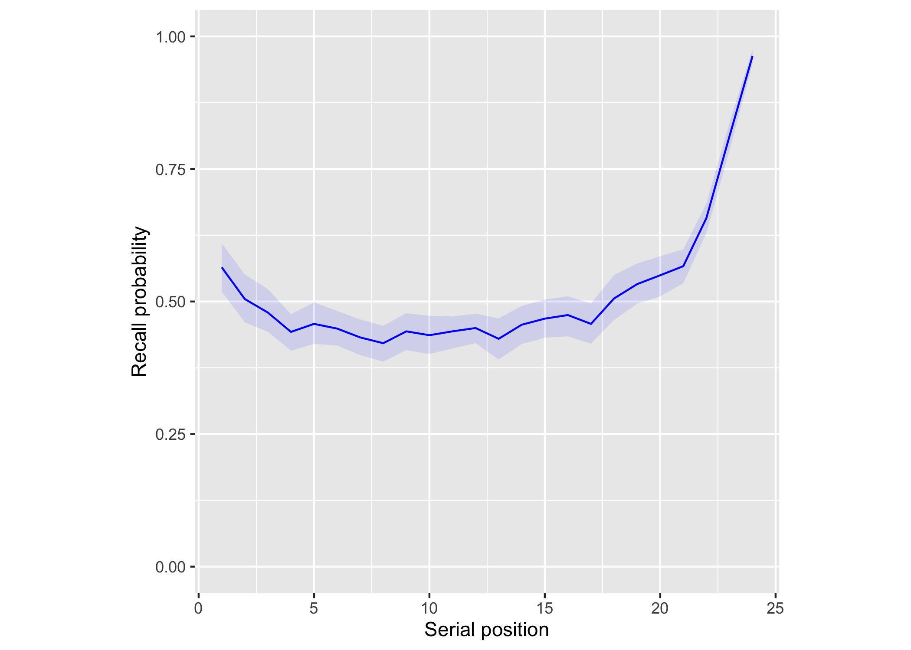
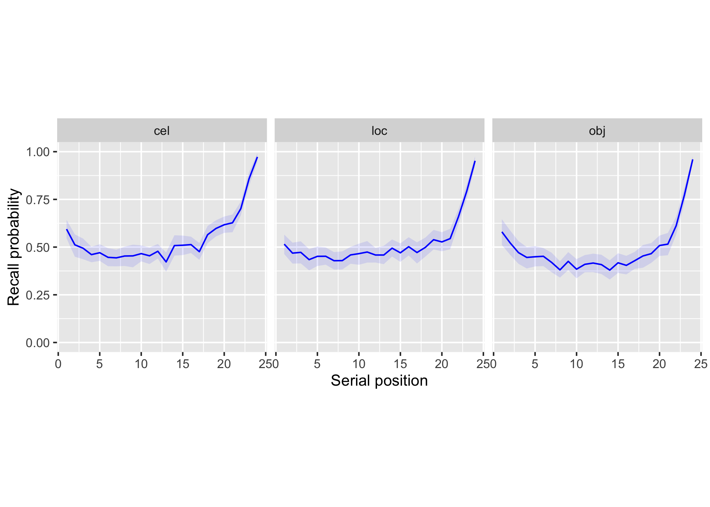

<!-- README.md is generated from README.Rmd. Please edit that file -->

# psifrr 

<!-- badges: start -->
<!-- badges: end -->

Analysis and visualization of free recall data.

psifrr relies on the
[Psifr](https://psifr.readthedocs.io/en/stable/index.html) Python
package, which is called from R using the `reticulate` package.

## Installation

First, install `remotes`:

``` r
install.packages("remotes")
```

Next, install psifrr with:

``` r
remotes::install_github("mortonne/psifrr")
```

## Working with free recall data

To load a sample dataset in [Psifr
format](https://psifr.readthedocs.io/en/stable/guide/import.html):

``` r
library(psifrr)
raw <- sample_data("Morton2013")
head(raw)
#>   subject list position trial_type       item item_number session list_type
#> 1       1    1        1      study      TOWEL         743       1      pure
#> 2       1    1        2      study      LADLE         631       1      pure
#> 3       1    1        3      study    THERMOS         735       1      pure
#> 4       1    1        4      study       LEGO         637       1      pure
#> 5       1    1        5      study   BACKPACK         521       1      pure
#> 6       1    1        6      study JACKHAMMER         621       1      pure
#>   category response response_time list_category
#> 1      obj        3         1.517           obj
#> 2      obj        3         1.404           obj
#> 3      obj        3         0.911           obj
#> 4      obj        3         0.883           obj
#> 5      obj        3         0.819           obj
#> 6      obj        1         1.212           obj
```

To analyze a dataset, we need to first score it by matching up study
items to recalled items. See [Scoring
data](https://psifr.readthedocs.io/en/stable/guide/score.html) for
details.

``` r
data <- merge_free_recall(raw, study_keys = list("category"))
```

We can use `filter_data` to a select one list for a sample of what the
results look like:

``` r
filter_data(data, subjects = 1, lists = 1)
#>    subject list          item input output study recall repeat intrusion
#> 0        1    1         TOWEL     1     13  TRUE   TRUE      0     FALSE
#> 1        1    1         LADLE     2    NaN  TRUE  FALSE      0     FALSE
#> 2        1    1       THERMOS     3    NaN  TRUE  FALSE      0     FALSE
#> 3        1    1          LEGO     4     18  TRUE   TRUE      0     FALSE
#> 4        1    1      BACKPACK     5     10  TRUE   TRUE      0     FALSE
#> 5        1    1    JACKHAMMER     6      7  TRUE   TRUE      0     FALSE
#> 6        1    1       LANTERN     7    NaN  TRUE  FALSE      0     FALSE
#> 7        1    1      DOORKNOB     8     11  TRUE   TRUE      0     FALSE
#> 8        1    1        SHOVEL     9      9  TRUE   TRUE      0     FALSE
#> 9        1    1        SHOVEL     9     19 FALSE   TRUE      1     FALSE
#> 10       1    1     WATER GUN    10    NaN  TRUE  FALSE      0     FALSE
#> 11       1    1 INK CARTRIDGE    11    NaN  TRUE  FALSE      0     FALSE
#> 12       1    1         PHONE    12     16  TRUE   TRUE      0     FALSE
#> 13       1    1    PAPER CLIP    13     17  TRUE   TRUE      0     FALSE
#> 14       1    1     MOUSETRAP    14     12  TRUE   TRUE      0     FALSE
#> 15       1    1       SPEAKER    15    NaN  TRUE  FALSE      0     FALSE
#> 16       1    1      CAR SEAT    16      5  TRUE   TRUE      0     FALSE
#> 17       1    1       BAYONET    17      3  TRUE   TRUE      0     FALSE
#> 18       1    1        MIRROR    18     15  TRUE   TRUE      0     FALSE
#> 19       1    1         STONE    19      8  TRUE   TRUE      0     FALSE
#> 20       1    1         WATCH    20      4  TRUE   TRUE      0     FALSE
#> 21       1    1          PILL    21      6  TRUE   TRUE      0     FALSE
#> 22       1    1     SMART CAR    22      2  TRUE   TRUE      0     FALSE
#> 23       1    1        REMOTE    23    NaN  TRUE  FALSE      0     FALSE
#> 24       1    1         CHAIN    24      1  TRUE   TRUE      0     FALSE
#> 25       1    1         CHAIN    24     14 FALSE   TRUE      1     FALSE
#>    category prior_list prior_input
#> 0       obj        NaN         NaN
#> 1       obj        NaN         NaN
#> 2       obj        NaN         NaN
#> 3       obj        NaN         NaN
#> 4       obj        NaN         NaN
#> 5       obj        NaN         NaN
#> 6       obj        NaN         NaN
#> 7       obj        NaN         NaN
#> 8       obj        NaN         NaN
#> 9       obj        NaN         NaN
#> 10      obj        NaN         NaN
#> 11      obj        NaN         NaN
#> 12      obj        NaN         NaN
#> 13      obj        NaN         NaN
#> 14      obj        NaN         NaN
#> 15      obj        NaN         NaN
#> 16      obj        NaN         NaN
#> 17      obj        NaN         NaN
#> 18      obj        NaN         NaN
#> 19      obj        NaN         NaN
#> 20      obj        NaN         NaN
#> 21      obj        NaN         NaN
#> 22      obj        NaN         NaN
#> 23      obj        NaN         NaN
#> 24      obj        NaN         NaN
#> 25      obj        NaN         NaN
```

See [Managing
data](https://mortonne.github.io/psifrr/reference/index.html#managing-data)
for a full list of functions that operate on free recall data.

## Recall performance

### Serial position curve

We can calculate average recall for each serial position using `spc`.

``` r
recall <- spc(data)
head(recall)
#>   subject input    recall
#> 1       1     1 0.5416667
#> 2       1     2 0.4583333
#> 3       1     3 0.6250000
#> 4       1     4 0.3333333
#> 5       1     5 0.4375000
#> 6       1     6 0.4791667
```

Next, we can calculate statistics for each serial position using
`boot_ci`. We’ll take the `recall` statistic, group by `input` position,
and calculate the mean and 95% bootstrap confidence interval for each
position.

``` r
library(dplyr, warn.conflicts = FALSE)
library(magrittr)
stats <- recall %>%
  group_by(input) %>% 
  summarise(boot_ci(recall), .groups = "drop")
head(stats)
#> # A tibble: 6 × 4
#>   input  mean lower upper
#>   <dbl> <dbl> <dbl> <dbl>
#> 1     1 0.565 0.518 0.611
#> 2     2 0.505 0.457 0.551
#> 3     3 0.479 0.436 0.519
#> 4     4 0.443 0.410 0.478
#> 5     5 0.458 0.422 0.498
#> 6     6 0.449 0.415 0.480
```

We can then plot the serial position curve with a confidence band using
`ggplot2`.

``` r
library(ggplot2)
ggplot(stats, aes(x = input)) +
  geom_line(color = "blue", aes(y = mean)) +
  geom_ribbon(alpha = 0.1, fill = "blue", aes(ymin = lower, ymax = upper)) +
  ylim(0, 1) +
  labs(x = "Serial position", y = "Recall probability") +
  theme(aspect.ratio = 1)
```



To calculate a serial position curve for multiple conditions, we can use
`group_by`. Here, we will group by stimulus category.

``` r
data$category <- as.character(data$category)
stats <- data %>% 
  group_by(category) %>% 
  summarise(spc(across()), .groups = "drop") %>%
  group_by(category, input) %>% 
  summarise(boot_ci(recall), .groups = "drop")
```

We can then split up by category when plotting.

``` r
ggplot(stats, aes(x = input)) +
  geom_line(color = "blue", aes(y = mean)) +
  geom_ribbon(alpha = 0.1, fill = "blue", aes(ymin = lower, ymax = upper)) +
  ylim(0, 1) +
  labs(x = "Serial position", y = "Recall probability") +
  facet_grid(cols = vars(category)) +
  theme(aspect.ratio = 1)
```



### Probability of Nth recall

We can also split up recalls, to test for example how likely
participants were to initiate recall with the last item on the list,
using `pnr`.

``` r
nth_recall <- pnr(data)
head(nth_recall)
#>   subject output input       prob actual possible
#> 1       1      1     1 0.00000000      0       48
#> 2       1      1     2 0.02083333      1       48
#> 3       1      1     3 0.00000000      0       48
#> 4       1      1     4 0.00000000      0       48
#> 5       1      1     5 0.00000000      0       48
#> 6       1      1     6 0.00000000      0       48
```

This gives us the probability of recall conditional on both output
position (`output`) and serial or input position (`input`).

### Prior-list intrusions

Participants will sometimes accidentally recall items from prior lists;
these recalls are known as prior-list intrusions (PLIs). To better
understand how prior-list intrusions are happening, you can look at how
many lists back those items were originally presented using
`pli_list_lag`.

First, you need to choose a maximum list lag that you will consider.
This determines which lists will be included in the analysis. For
example, if you have a maximum lag of 3, then the first 3 lists will be
excluded from the analysis. This ensures that each included list can
potentially have intrusions of each possible list lag.

``` r
pli <- pli_list_lag(data, max_lag = 3)
head(pli)
#>   subject list_lag count   per_list       prob
#> 1       1        1     7 0.15555556 0.25925926
#> 2       1        2     5 0.11111111 0.18518519
#> 3       1        3     0 0.00000000 0.00000000
#> 4       2        1     9 0.20000000 0.19148936
#> 5       2        2     2 0.04444444 0.04255319
#> 6       2        3     1 0.02222222 0.02127660
```

The analysis returns a raw count of intrusions at each lag (`count`),
the count divided by the number of included lists (`per_list`), and the
probability of a given intrusion coming from a given lag (`prob`).

## Temporal clustering

### Lag conditional response probability

In all CRP analyses, transition probabilities are calculated conditional
on a given transition being available. For example, in a six-item list,
if the items 6, 1, and 4 have been recalled, then possible items that
could have been recalled next are 2, 3, or 5; therefore, possible lags
at that point in the recall sequence are -2, -1, or +1. The number of
actual transitions observed for each lag is divided by the number of
times that lag was possible, to obtain the CRP for each lag.

``` r
crp <- lag_crp(data)
head(crp)
#>   subject lag       prob actual possible
#> 1       1 -23 0.02083333      1       48
#> 2       1 -22 0.03571429      3       84
#> 3       1 -21 0.02631579      3      114
#> 4       1 -20 0.02400000      3      125
#> 5       1 -19 0.01438849      2      139
#> 6       1 -18 0.01219512      2      164
```

The results show the count of times a given transition actually happened
in the observed recall sequences (`actual`) and the number of times a
transition could have occurred (`possible`). Finally, the `prob` column
gives the estimated probability of a given transition occurring,
calculated by dividing the actual count by the possible count.

### Compound lag conditional response probability

The compound lag-CRP was developed to measure how temporal clustering
changes as a result of prior clustering during recall. They found
evidence that temporal clustering is greater immediately after
transitions with short lags compared to long lags. The
`lag_crp_compound` analysis calculates conditional response probability
by lag, but with the additional condition of the lag of the previous
transition.

``` r
compound_crp <- lag_crp_compound(data)
head(compound_crp)
#>   subject previous current prob actual possible
#> 1       1      -23     -23  NaN      0        0
#> 2       1      -23     -22  NaN      0        0
#> 3       1      -23     -21  NaN      0        0
#> 4       1      -23     -20  NaN      0        0
#> 5       1      -23     -19  NaN      0        0
#> 6       1      -23     -18  NaN      0        0
```

The results show conditional response probabilities as in the standard
lag-CRP analysis, but with two lag columns: `previous` (the lag of the
prior transition) and `current` (the lag of the current transition).

### Lag rank

We can summarize the tendency to group together nearby items by running
a lag rank analysis using `lag_rank`. For each recall, this determines
the absolute lag of all remaining items available for recall and then
calculates their percentile rank. Then the rank of the actual transition
made is taken, scaled to vary between 0 (furthest item chosen) and 1
(nearest item chosen). Chance clustering will be 0.5; clustering above
that value is evidence of a temporal contiguity effect.

``` r
ranks <- lag_rank(data)
head(ranks)
#>   subject      rank
#> 1       1 0.6109533
#> 2       2 0.6356764
#> 3       3 0.6126071
#> 4       4 0.6670897
#> 5       5 0.6439234
#> 6       6 0.6484440
```

## Category clustering

### Category conditional response probability

If there are multiple categories or conditions of trials in a list, we
can test whether participants tend to successively recall items from the
same category. The category-CRP, calculated using `category_crp`,
estimates the probability of successively recalling two items from the
same category.

``` r
cat_crp <- category_crp(data, "category")
head(cat_crp)
#>   subject      prob actual possible
#> 1       1 0.8011472    419      523
#> 2       2 0.7334559    399      544
#> 3       3 0.7631579    377      494
#> 4       4 0.8148820    449      551
#> 5       5 0.8772727    579      660
#> 6       6 0.8096154    421      520
```

### Category clustering measures

A number of measures have been developed to measure category clustering
relative to that expected due to chance, under certain assumptions. Two
such measures are list-based clustering (LBC) and adjusted ratio of
clustering (ARC). These measures can be calculated using the
`category_clustering` function.

``` r
clust = category_clustering(data, "category")
head(clust)
#>   subject      lbc       arc
#> 1       1 2.286232 0.6145451
#> 2       2 1.846014 0.4078391
#> 3       3 2.102355 0.6273712
#> 4       4 2.778080 0.6887610
#> 5       5 4.706522 0.8737552
#> 6       6 2.801630 0.7239257
```

Both measures are defined such that positive values indicate
above-chance clustering. ARC scores have a maximum of 1, while the upper
bound of LBC scores depends on the number of categories and the number
of items per category in the study list.

## Semantic clustering

### Distance conditional response probability

Models of semantic knowledge allow the semantic distance between pairs
of items to be quantified. If you have such a model defined for your
stimulus pool, you can use the distance CRP analysis to examine how
semantic distance affects recall transitions.

You must first define distances between pairs of items. Here, we use
correlation distances based on the wiki2USE model.

``` r
d <- sample_distances("Morton2013")
```

We also need a column indicating the index of each item in the distances
matrix. We use `pool_index` to create a new column called `item_index`
with the index of each item in the pool corresponding to the distances
matrix.

``` r
data$item_index <- pool_index(data$item, d$items)
```

Finally, we must define distance bins. Here, we use 10 bins with equally
spaced distance percentiles. Note that, when calculating distance
percentiles, we use the `squareform` function to get only the
non-diagonal entries.

``` r
percentiles <- pracma::linspace(.01, .99, 10)
edges <- quantile(pracma::squareform(d$distances), percentiles)
```

We can now calculate conditional response probability as a function of
distance bin using `distance_crp`, to examine how response probability
varies with semantic distance.

``` r
dist_crp <- distance_crp(data, "item_index", d$distances, edges)
head(dist_crp)
#>   subject    center       prob actual possible
#> 1       1 0.4675320 0.08545557    151     1767
#> 2       1 0.6177484 0.06791569     87     1281
#> 3       1 0.6736562 0.06250000     65     1040
#> 4       1 0.7110752 0.05183585     48      926
#> 5       1 0.7420689 0.05063291     44      869
#> 6       1 0.7708671 0.02836879     24      846
```

### Distance rank

Similarly to the lag rank analysis of temporal clustering, we can
summarize distance-based clustering (such as semantic clustering) with a
single rank measure. The distance rank varies from 0 (the most-distant
item is always recalled) to 1 (the closest item is always recalled),
with chance clustering corresponding to 0.5. Given a matrix of item
distances, we can calculate distance rank using `distance_rank`.

``` r
ranks <- distance_rank(data, "item_index", d$distances)
head(ranks)
#>   subject      rank
#> 1       1 0.6355710
#> 2       2 0.5714568
#> 3       3 0.6272815
#> 4       4 0.6375957
#> 5       5 0.6461814
#> 6       6 0.6002912
```

### Distance rank shifted

Like with the compound lag-CRP, we can also examine how recalls before
the just-previous one may predict subsequent recalls. To examine whether
distances relative to earlier items are predictive of the next recall,
we can use a shifted distance rank analysis using
`distance_rank_shifted`.

Here, to account for the category structure of the list, we will only
include within-category transitions.

``` r
ranks <- distance_rank_shifted(data, "item_index", d$distances, 4, test_key = "category", test = function(x, y) x == y)
head(ranks)
#>   subject shift      rank
#> 1       1    -4 0.5186171
#> 2       1    -3 0.4921032
#> 3       1    -2 0.5160634
#> 4       1    -1 0.5791984
#> 5       2    -4 0.4639307
#> 6       2    -3 0.4965965
```

The distance rank is returned for each shift. The -1 shift is the same
as the standard distance rank analysis.
